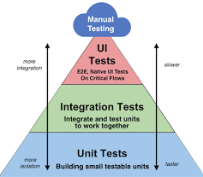

## About Me

Hello there!  I'm Laysan, a dedicated Quality Assurance Automation Engineer with a passion for ensuring the reliability, performance, and scalability of software applications. With a keen eye for detail and a commitment to quality, I specialize in designing and implementing automated testing solutions to streamline the testing process.

## Overview

Welcome to my portfolio! This repository showcases my work in software development and quality assurance. Each project has its own folder with detailed information.

### Project 1: XSHOP

- Description: XSHOP - Online Clothing Store.
- Technologies Used: HTML, CSS, JavaScript, https://console.firebase.google.com/

### Project 2: E-Commerce Electronic Store Testing 
- The primary goal of this project is to conduct end-to-end testing of the electronic store's e-commerce platform. This includes validating critical workflows, ensuring the functionality of search features, verifying the checkout process, and confirming the accuracy of product information.
- Technologies Used: Java, TestNG, Playwright, Allure, POM.

### 🚀 Skills

- **Programming Languages:** Java, Python, JavaScript, HTML, CSS, JSON
- **Automation Frameworks:** Playwright, Selenium WebDriver, Maven, TestNG, JUnit, Node.js, Cucumber, Cypress
- **API Testing:** Swagger, Selenium DevTools, Postman, Playwright, Charles Proxy
- **Backend Testing:** SQL, JDBC
- **CI/CD:** GitHub Actions, Jenkins
- **Version Control:** Git
- **Test Management:** Jira, TestRail, Zephyr, Trello, QTest, QAlity Plus, Confluence

|                |                                                                                                                               |
|:--------------:|:-----------------------------------------------------------------------------------------------------------------------------:|
| Profile Visits |                                                        |
| GitHub Status  |  |

|                 **Testing**                 |                                                                                                                                                                                                                            **What I Bring to the QA Table:**                                                                                                                                                                                                                             |
|:-------------------------------------------:|:----------------------------------------------------------------------------------------------------------------------------------------------------------------------------------------------------------------------------------------------------------------------------------------------------------------------------------------------------------------------------------------------------------------------------------------------------------------------------------------:|
|  | 
     - Detail-Oriented Approach: I meticulously analyze requirements to design comprehensive test cases and scripts, covering various scenarios.  - Collaborative Mindset: I believe in effective communication and collaboration with development and product teams to ensure a unified approach to quality.  - Continuous Learning: In the ever-evolving field of QA, I stay updated with the latest tools and methodologies to enhance the testing process.
 |

### 📫 Let's Connect:
Feel free to explore my repositories, and let's connect [ LinkedIn](https://www.linkedin.com/in/laysan-martin/) if you're interested in discussing QA, automation, or anything related to software quality assurance. Happy testing! 🚀
